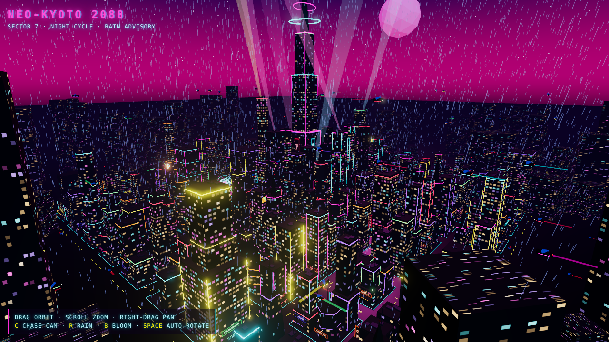
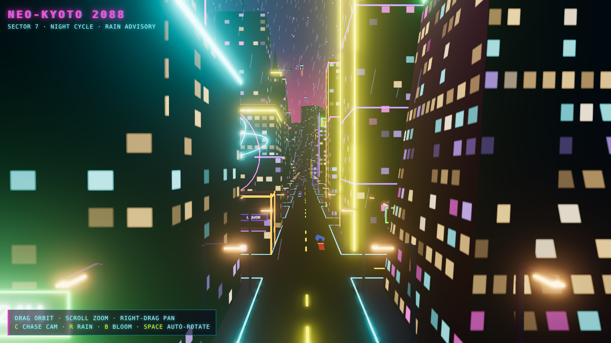

# claudecloud

A 3D model of a house built with [Three.js](https://threejs.org/).

It has a gabled roof, door with step, framed windows, a round attic window, a brick
chimney with drifting smoke, a stepping-stone path, bushes, and two trees, with
real-time shadows.

## Run it

There is no build step. Three.js is loaded from a CDN through an import map, so the
page only needs to be served over HTTP (ES modules don't load from `file://`):

```sh
python3 -m http.server 8000
# then open http://localhost:8000
```

Drag to orbit, scroll to zoom, right-drag to pan.

## Files

- `index.html`: page shell and import map
- `main.js`: scene, house geometry, lighting and render loop

## Cyberpunk city (`cyberpunk/`)

A low-poly, rain-soaked neon city at night: open `http://localhost:8000/cyberpunk/`
with the same server as above.




- A 9×9 block grid of flat-shaded towers (boxes, stepped towers, hex prisms and
  tapered pyramids) with procedurally lit windows, neon trim, rooftop antennas and
  blinking warning lights. Buildings get taller toward the centre.
- A central megatower with rotating crown rings, giant vertical signs, animated
  billboards and sweeping searchlights.
- Neon shop signs and awnings at street level, vertical katakana signs, and
  shader-driven advertising screens that cycle and glitch.
- A plaza with a floating wireframe hologram and neon cherry trees.
- Flying cars in sky lanes and cars on the streets, with light trails.
- Rain, a low-poly moon, stars and a distant skyline fading into the fog.
- Bloom post-processing makes everything neon glow.

The layout uses a seeded random generator, so it's the same city every load.

Keys: **C** chase cam (ride along with a flying car), **R** rain, **B** bloom,
**Space** auto-rotate.
